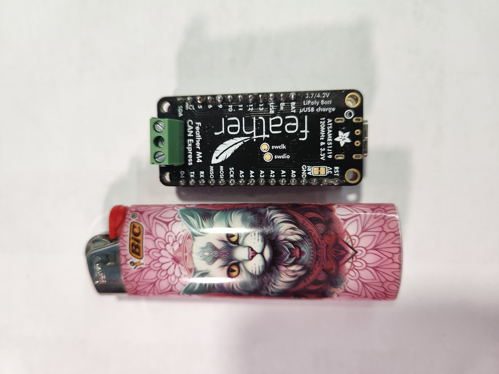
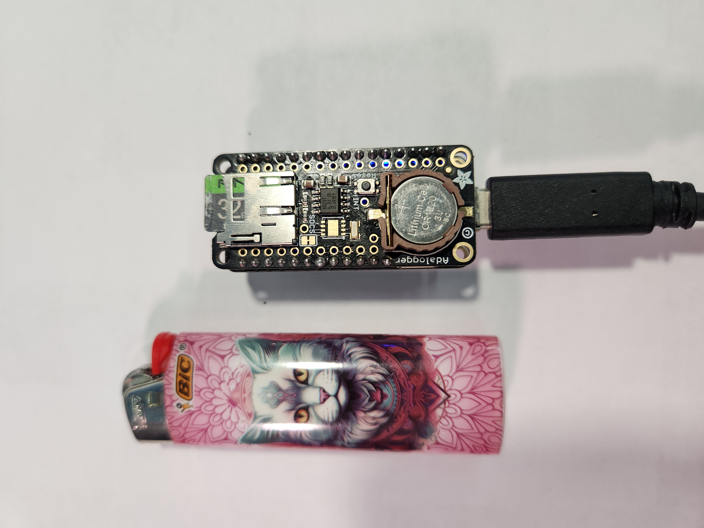
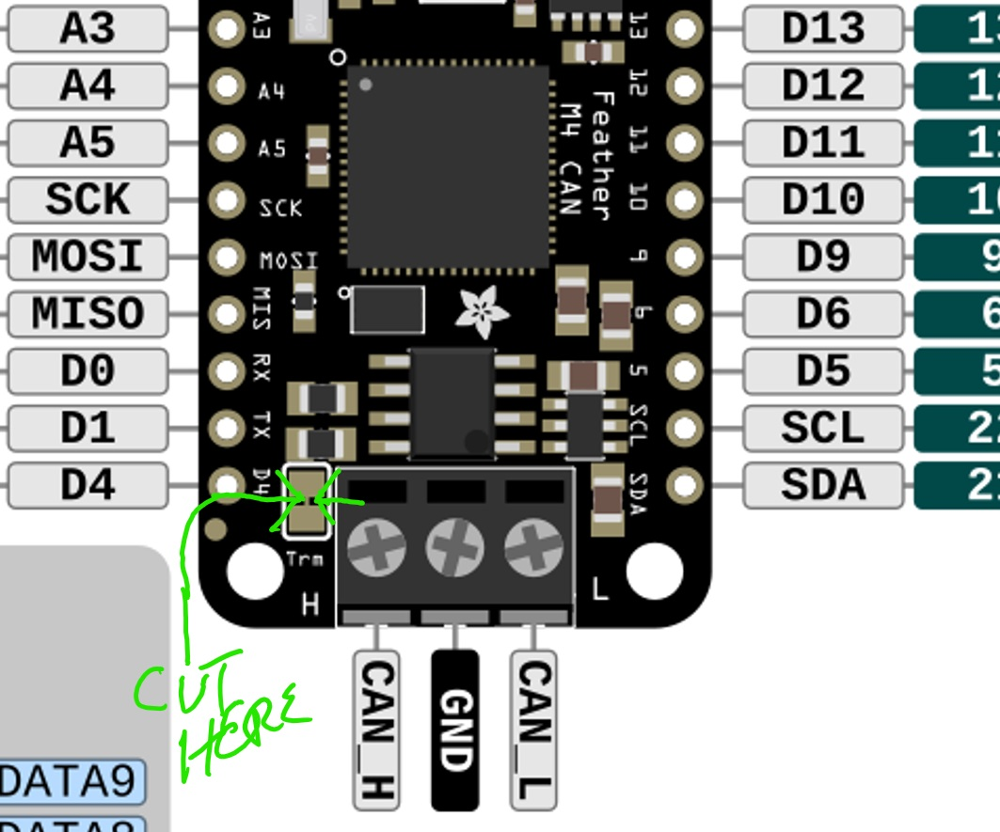
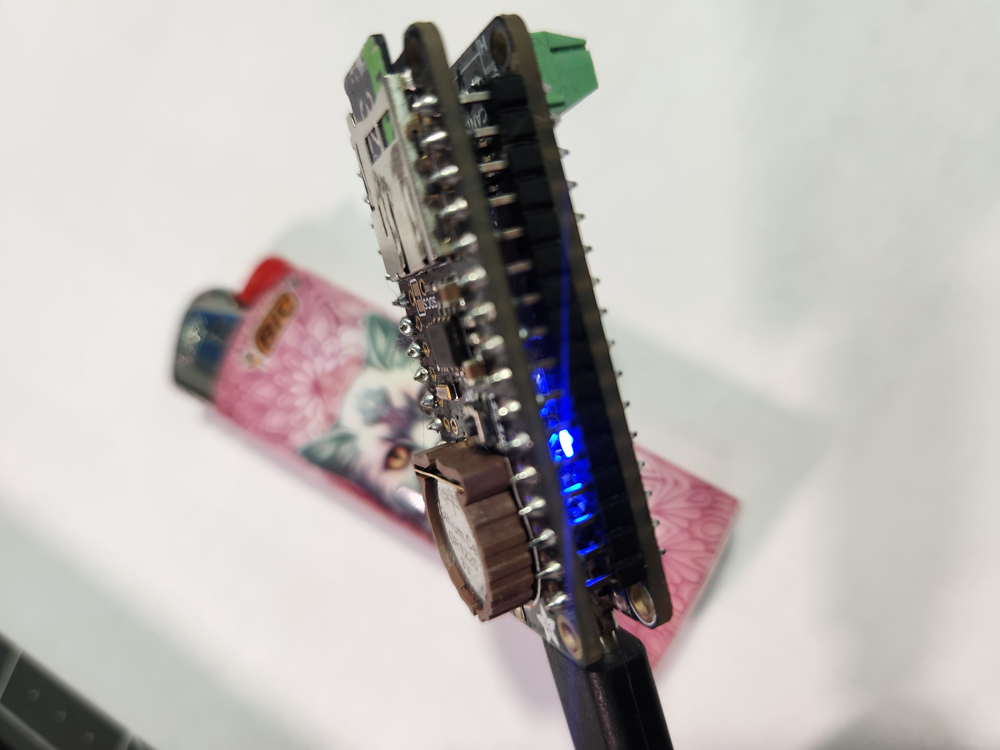

Mirrored from [`wiki/Hardware-Assembly.md`](https://github.com/kidturbo/Flashy/blob/main/wiki/Hardware-Assembly.md) by the [sync workflow](https://github.com/kidturbo/Flashy/actions/workflows/sync-wiki.yml). Direct edits in the GitHub Wiki UI will be overwritten on the next push to `main` — [edit upstream](https://github.com/kidturbo/Flashy/edit/main/wiki/Hardware-Assembly.md) instead.

# Hardware Assembly

Flashy uses two stacked Adafruit Feather boards. Total build time is about 15 minutes once you have the parts. The assembled device can talk to any CAN-based automotive module — ECMs, TCMs, BCMs, or other nodes — either through the OBD-II port or on a bench harness.

## Parts List

| Part | Adafruit # | Purpose |
|------|-----------|---------|
| [Feather M4 CAN Express](https://www.adafruit.com/product/4759) | 4759 | MCU + built-in CAN transceiver + 5V boost |
| [AdaLogger FeatherWing](https://www.adafruit.com/product/2922) | 2922 | microSD card slot + RTC for on-device logging |
| [Stacking headers](https://www.adafruit.com/product/2830) | 2830 | Connect the two boards without blocking pins |
| microSD card | — | Any size, FAT32 formatted |
| CR1220 coin cell | — | Powers the RTC on the AdaLogger |
| OBD-II cable or bench harness | — | With CAN-H, CAN-L, and ground broken out |

---

## Step 1 — Solder Stacking Headers

Solder the stacking headers onto the **Feather M4 CAN Express**. Leave the **AdaLogger** with standard pin headers (soldered pointing down) so it sits on top.

This way the Feather sits on the bottom with pins exposed for debugging, and the AdaLogger plugs in from above.

> **Important — where to mount the CAN terminal block:** The 3-pin CAN screw terminal block that ships with the Feather M4 CAN has its screws facing *upward*. If you mount the terminal block on top of the Feather with the AdaLogger stacked above, you cannot fit a screwdriver onto the terminal screws to wire the CAN bus. Taller stacking headers don't solve this — even with vertical clearance, the wing blocks screwdriver access from above.
>
> Mounting the AdaLogger *below* the Feather isn't a good workaround either: it covers the RTC coin-cell holder, making battery swaps a pain.
>
> **Recommended approach — mount the terminal block on the *bottom* side of the Feather.** This gives you clean screwdriver access from the top (unobstructed by the wing), and the AdaLogger sits normally on top with its RTC battery reachable. This is the approach used in the reference build shown in the photos above.
>
> **Alternatives if you don't like the bottom-mount look:**
>
> - Skip the terminal block entirely — solder the CAN-H, CAN-L, and GND wires directly to the Feather's pads. Clean, permanent, fits any enclosure.
> - Use a flatter side-entry 3-pin terminal block (screws enter from the side instead of the top) so the AdaLogger can stack normally without blocking access.
>
> See Adafruit's [AdaLogger assembly guide](https://learn.adafruit.com/adafruit-adalogger-featherwing/assembly) for header options and soldering tips.

**Pinout references (useful while soldering):**

- [Feather M4 CAN pinout](https://learn.adafruit.com/adafruit-feather-m4-can-express/pinouts)
- [AdaLogger FeatherWing pinout](https://learn.adafruit.com/adafruit-adalogger-featherwing/pinouts)

*Feather M4 CAN Express — bottom board. Screw terminals are already installed for CAN bus connection.*

*AdaLogger FeatherWing — top board. Shown here with the RTC coin cell installed.*

---

## Step 2 — Break the 120Ω CAN Terminator

The Feather M4 CAN Express ships with a **120Ω termination resistor bridged by default**, which is correct for a standalone 2-node bus. But a vehicle CAN bus is already fully terminated (typically 120Ω at each end of the backbone), so adding a third terminator loads the bus and causes reflections / errors.

**You must cut this bridge before connecting to a real vehicle or an already-terminated bench harness.**

> ⚠️ **Do this BEFORE stacking the AdaLogger on top.** Once the wing is plugged in, the `Trm` jumper is physically covered by the SD wing and is no longer reachable. If you've already stacked, you'll need to unstack to cut.

*The `Trm` jumper sits just above the CAN screw terminals, between pins D4 and CAN-H. Cut the trace between the two small pads.*

**How to cut it:** use a sharp utility knife or a small chisel-tip soldering iron to sever the trace between the two pads marked `Trm`.

**Verify with a multimeter:** with the board unpowered, measure between CAN-H and CAN-L screw terminals.
- Before cutting: ~60Ω (the onboard 120Ω in parallel with the CAN transceiver's differential termination) or ~120Ω depending on board revision
- After cutting: open (OL) or very high resistance

> **When you DO want the terminator:** if you're probing an isolated module on a bench with no other terminator on the harness, you need 120Ω somewhere on the bus. In that case, leave the jumper intact or add an external terminator. The rule is: two terminators total on the backbone, no more, no less.

---

## Step 3 — Stack the Boards

Plug the AdaLogger on top of the Feather M4 CAN Express. The USB port, reset button, and NeoPixel should all remain visible/accessible from the top.

*Stacked Feather + AdaLogger, powered up — blue LEDs indicate the device is running.*

---

## Step 4 — CAN Bus Wiring

Wire the CAN screw terminals to your OBD-II cable or bench harness:

### OBD-II Connection

| Feather Terminal | OBD-II Pin | Wire |
|------------------|-----------|------|
| CAN-H | Pin 6 | High-speed CAN high |
| CAN-L | Pin 14 | High-speed CAN low |
| GND | Pin 4 or 5 | Chassis/signal ground |

> **Power:** Flashy is powered from USB. Do not tie OBD-II +12V (pin 16) to the Feather. Keep them electrically isolated.

### Bench Harness Connection

For working on an isolated module (ECM, TCM, BCM, etc.) on a bench:
- Connect CAN-H and CAN-L to the module's CAN pins
- Connect GND to the module's signal/chassis ground
- Provide the module's required +12V / ignition power from a bench supply (separately from the Feather)
- **Verify proper CAN bus network termination: ~60Ω between CAN-H and CAN-L.** With Flashy connected to the bus and everything powered down, measure resistance across the CAN-H and CAN-L screw terminals with a multimeter. Proper CAN bus termination requires **two 120Ω resistors — one at each end of the bus** — which appear in parallel and measure ~60Ω. A reading of ~120Ω means only one terminator is present; open/infinite means no termination. Improper termination causes read/write errors, reflected signals, and frame losses that may appear as intermittent bugs in Flashy operations.

Pinouts for specific modules are published in the [ECU Reference Guide](https://kidturbo.github.io/Flashy/ecu-reference.html).

---

## Step 5 — Insert microSD Card

Format a microSD card as FAT32 and insert it into the AdaLogger. The card is used to:
- Stream full module reads directly to a `.bin` file (no USB throughput bottleneck)
- Hold source `.bin` files for flash writes
- Log CAN bus captures for later analysis

See [Getting Started](Getting-Started) for the first power-up and firmware flash.
